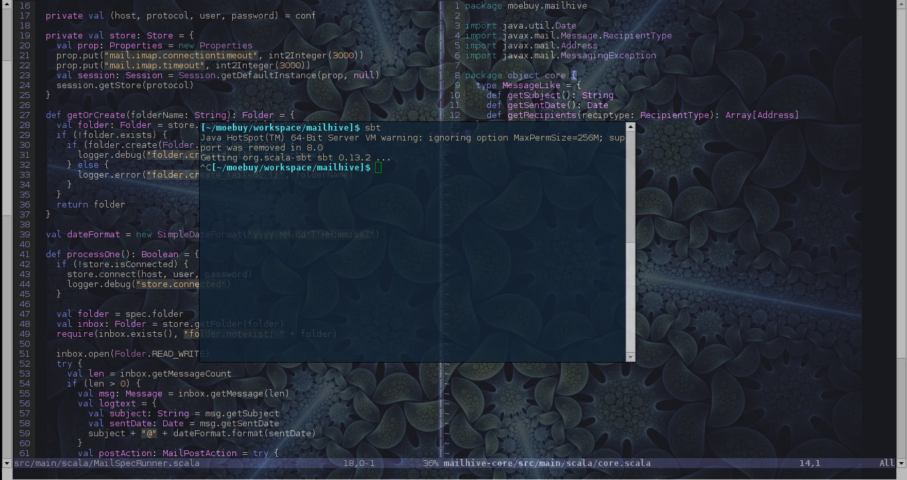

　　开 Vim 的时候通常是占满整个屏幕的，但这时又想开个终端显示编译结果。

　　几种思路：

1. 用两个显示器，一个显示 Vim ，一个显示终端 -> 我可不想来回转头，脖子累 / 我没钱买显示器 / 我的桌子太小放不下
2. 用 tmux 分屏 -> 我希望开一个 Vim 实例然后在里面用 :sp / :vs 分屏，因为这样补全信息可以共享
3. 在 Vim 中使用 [VimShell](https://github.com/Shougo/vimshell.vim) 插件 -> VimShell 看起来不如原始终端靠谱，有时会有奇怪的错误

　　最后我选择了使用 awesome 窗口管理器的浮动模式，将终端窗口设置为浮动。可以用快捷键快速在两个窗口之间切换：

　　当焦点在 Vim 窗口上，由于窗口有透明度，可以隐隐看到下面的终端窗口的编译情况，感觉挺好。

　　想来，这不是 Windows 下最常见的做法吗，我竟然现在才发现！
