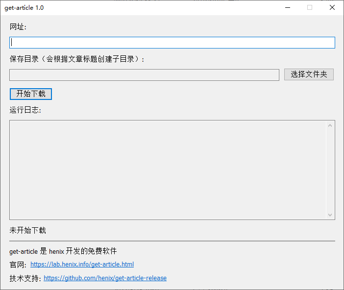

　　get-article 的功能是将一篇网络文章以及引用的所有资源（图片、公式、音频、视频等）完整地存档到本地。包含命令行和图形界面程序。

　　我的目标是做成“网络文章”领域的 youtube-dl 。

　　如何使用以及下载请到：<https://lab.henix.info/get-article.html>

　　下面我重点谈谈这个软件的创作背景。

　　可能大家第一眼看到这个东西的时候会有一些疑问：

* 我为什么需要它？
* 它跟 RSS 有什么区别？
* 我用浏览器的 Ctrl+S 另存为不也可以实现这个功能？
* 我用笔记软件的网页剪藏不也可以？

　　我做这个软件是因为我收藏了好几篇微信公众号文章，我希望把它们离线存档下来，做成类似电子书的东西，拷贝到任何地方都可以直接打开看，这样我才觉得是真正“拥有”这篇文章。

　　文章存档应该具有如下性质：

1. 你完全拥有这篇文章的全部数据，因此你可以在断网的情况下浏览。换句话说，文章的全部数据保存在本地
2. 保存的格式应该是开放的，从而可以在各种操作系统和软件中打开

　　看过我过去的文章的朋友可能知道，我对上网这件事的看法是，少用“关注”、少用 RSS ，提倡多读书、多读经典（参见《[谈经典](../on-classics/)》）。

　　这就产生了一个问题：网络文章中可能产生“经典”吗？或者退一步讲，“高质量”文章？

　　经过这么多年上网实践，我认为确实存在那么一些文章，我可能会时常拿出来反复阅读。对于这样的文章，我希望用书籍的标准对待它们——那就是把它们完全保存下来。经常上网的朋友肯定知道，网络文章突然消失的概率不低，近年来还有越来越频繁的迹象。

* 可能是因为审查或者审查标准变了
* 可能是因为被多人举报
* 可能是作者自己删除
* 也可能是因为网站关闭

　　如果你上网的时间足够长，你可能已经见证了很多网站的关闭：blogcn 、网易博客、百度贴吧 2017 年之前的帖子、百度空间、……

　　有了以上的背景，下面就可以讨论 get-article 这一网络文章存档工具跟其他类似工具的异同了：

　　RSS 是发生了一件事之后你会得到通知。RSS 更强调提醒、通知（notify）、推送（push）。而 get-article 更强调存档（archive）。RSS 也可以输出全文，但一般不会把文章用到的图片甚至视频全部保存下来。

　　这也可以解释我为什么不想做“保存专栏中所有文章”的功能，而必须让用户一篇一篇地手动保存：我认为不太可能一整个专栏里所有文章都是“经典”或“高质量”的。你没有那么多文章要存。不妨运用你的判断力筛选出真正重要的东西吧！这个世界上真正重要的东西是稀少的，你不可能说每样东西都重要。

　　换句话说，我认为不是所有的“方便”都值得追求，有时候我们需要某种“不方便”。因为“不方便”强迫我们去分辨真正重要的东西。

　　浏览器的类似功能：

　　在 Chrome 中按 Ctrl+S 可以选择保存为完整 html 或者 mht 。Chrome 也有打印到 pdf 功能，可以将网页保存为 pdf 格式。

* pdf 的问题：无法方便地拿到单独的图片文件、对动态内容支持不够
* 网页另存为的问题

  1. 对微信公众号等按需加载的图片保存后的网页上可能显示不出来
  2. 保存了很多无用的 js ，后续本地打开的时候还会执行 js ，执行出错导致页面错乱

　　笔记软件（如印象笔记、Obisdian）的网页剪藏的问题：

1. 必须跟特定的笔记软件配合使用
2. 图片可能是保存到该笔记软件的服务器或者第三方云存储，而非用户本地
3. 对页面上的数学公式、视频等动态元素支持可能不够完善

　　另外，我经常用稍后阅读软件 getpocket 保存微信公众号文章，但只要文章里带有数学公式，那基本上就没办法看：因为在 getpocket 里数学公式全部显示不出来。

　　总体说来，浏览器的打印到 pdf 是大致能符合我的要求的，但细节不够完善。

### 未来展望

　　如果这个工具的用户足够多，根据用户反馈的情况，我可能会考虑在未来增加以下功能：

* 保存为 epub 格式（目前为一个文件夹）
* 下载支持断点续传
