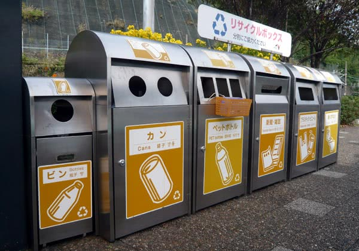

　　首先必须下个定义：什么是“用户界面”（User Interface）？

　　在我看来，凡是由人在其上操作、与人产生交互的东西都是用户界面：

* 一个水杯、一把钥匙是用户界面
* 微波炉上密密麻麻的按钮、汽车里的方向盘、油门、刹车也是用户界面
* Google 的搜索框、微软的 Word 文字处理软件是用户界面
* Java API、HTML 语言亦是用户界面

　　其实编程的过程经常涉及用户界面设计：不仅仅是终端用户看得见的“界面”，供其他程序员使用的 API 、编程语言特性等也是界面，而且是更重要的界面。

　　回顾自己多年的编程实践，以及对生活的观察，我总结了用户界面设计的几条原则，跟大家一起探讨：

### 1. 让用户不可能以错误的方式使用

　　我自己印象最深的是日本的门锁。若干年前，我跟我的两位大学好友一起去日本玩。我们通过 Airbnb 找了个短租，位于东京的一栋电梯公寓。有一天我们早上出门，我锁上门之后才猛然发现忘记带钥匙，但此时我们三个人都已经在门外了。这个时候我有点慌，脑子里已经开始构思各种最坏的情况：比如证件还在里面怎么办，是不是该先联系房东，如果房东没有备用钥匙的话，那难道要报警……？正当我想着这些的时候，下意识地又去检查了门锁，想再试试能不能用某种方式打开。神奇的是，门居然没锁！原来这个门是必须用钥匙才能锁的。我随手关上门时听到“咔哒”一声，就误以为已经锁上了。

　　我从这件事中学到了什么呢？

　　锁是生活中最常见的物件之一。我们可以用锁来防止坏人进入房间，但也可能把我们自己锁在门外。解决这个问题的思路有两种：第一种是要求用户出门前必须记得带钥匙，我相信大部分人已经养成了出门前检查手机、钱包和钥匙的习惯。还有一种方法，那就是重新设计锁，使得用户必须用钥匙才能锁上，从而不可能出现“门锁了但钥匙忘带”这种情况。

　　回想你入住的宾馆，进门处一定有一个卡槽，用来插房卡，插了房卡后整个房间才通电。这样你永远不会忘记插房卡——也永远不会忘记出门的时候顺手带上房卡。

　　说回日本，走在日本的街头，你一定不会错过一样风景——日本的垃圾桶。由于政府推行垃圾分类，日本的垃圾桶长这样：

　　如果你对比一下我国的带垃圾分类的功能的垃圾桶和上图中的日本的垃圾桶，立即就能发现其中差异：日本的垃圾桶，专门扔塑料瓶、易拉罐的，开口为圆形；专门扔书报、杂志的，开口为长条形。往这样的垃圾桶扔东西，你很难把垃圾扔到错误的分类。而这不是通过让你记住某种垃圾属于什么分类来实现的，而是通过设计上的引导，让你难以或无法犯错。

　　日常生活中的很多东西，我认为都可以应用这条原则来让它们变得更加易用。如果一样东西，操作它必须遵守一套复杂的规则，不遵守就会产生严重后果，显然，这会增加使用者的心智负担（mental burden），让使用者用起来提心吊胆。这是让人适应机器，但人永远不可能是机器。

　　每个人都难免犯错，好的设计考虑到用户可能犯错并在错误发生时加以修正，而不至于让系统完全瘫痪。这也降低了系统的学习和使用成本。

　　我相信好的设计应该将“人”放置于“工具”之前。作为一名日常工作就是设计工具的“设计师”（程序员），我希望自己创造的工具可以服务人，而不是让人受制于工具。

　　将这条设计原则应用在编程中的话我们就得到了类型系统。类型系统的作用就是防止你用刀的时候砍到自己的手，或者说防止你用错误的方式使用自己或他人的代码。有人认为类型系统限制了我们的自由。但在我看来，它是让我们用今天的自律（self-discipline）换取明天的自由，比如重构的自由[^1]。正如每个生活在现代社会的人都学会了用自律——遵守法律，来换取法律赋予我们的自由（参见罗翔老师的视频）。因此如果是一次性的代码，我认为用动态语言也无妨，但如果是要长期维护的代码，我肯定是更倾向用静态语言。

### 2. 让常用的功能变得容易，让不常用的功能变得可能

　　假如你现在要搬进一间卧室，里面有桌子、衣柜。桌面下方和两侧有抽屉；衣柜分为左右两部分，右边用隔板隔成三格可以放东西；衣柜上层也有柜子可以放东西，但人必须踩在椅子上才够得着。你打算怎样利用这些空间来放置个人物品？

　　你的手机上有若干个屏幕：开机就显示的首屏、左右划一次会出现的屏幕，还有划两次的屏幕……而下方的快捷栏是所有屏幕上都会显示的。你安装的应用有很多，不是一屏就能放得下的。你应该怎么决定每个应用的图标放在哪里？

　　老板让你设计一个管理后台，供各个业务的运营人员操作。管理后台的左边有一个常驻菜单，点击可下拉出二级菜单。管理后台的顶部可以放若干导航按钮，每个按钮可以有下拉菜单。你应该如何决定每个功能放在什么位置？

　　生活告诉我的方法是：根据每个物件的使用频率。使用频率越高的东西，放在离用户越近的地方；使用频率越低的东西，放在离用户越远的地方。

　　我们使用的语言也有这样的特征：在英语中，常用单词（如 I, a, the）比不常用的单词短。

　　如果把这类设计看成是为我们跟系统之间的“通信”选择一个“编码”，根据香农的[信息论](https://zh.wikipedia.org/wiki/%E4%BF%A1%E6%81%AF%E8%AE%BA)，出现频率越高的东西，其信息熵越低，采用较短的编码，可以[压缩](https://zh.wikipedia.org/wiki/%E7%86%B5%E7%B7%A8%E7%A2%BC%E6%B3%95)通信所需的数据量，从而节省“带宽”——对应到生活中，就是节省我们的操作。

　　在编程中这条原则的应用有很多。比如一个模块有很多功能，哪些功能是调一个函数直接就能用的，哪些功能是需要新建一个对象进行一系列操作才能用的？Rust 的变量默认不可变，必须加 mut 修饰符才可变；而 C++ 的变量默认可变，必须加 const 才不可变：这体现出这两门语言的设计者对什么操作使用频率较高有不同的理解。

### 3. 追求“无说明书”式设计

　　最好的设计是没有说明书的：它不需要一个额外的东西来告诉你该怎么使用。要么你看一眼就知道它的用法；要么你通过“把玩”它，可以摸索出用法。它是一个谜，等待你来破解。

　　当你走进商场，看见自动扶梯徐徐上升，旁边没有任何告示牌写着“站在这里，你就可以上二楼”。但你只要看过别人乘坐自动扶梯，即使你以前从来没见过这种东西，你也能立即知道它的作用。

　　好的设计如同生活本身，它们永远是沉默的。说明书是喧闹的设计者拿着高音喇叭告诉你“这就是我的游戏规则，你必须遵守！”，但你永远可以跳出那些规则，或者创造自己的规则。你永远可以用设计者预想之外的方式使用一样东西，正如我们永远可以用前人未曾设想过的方式生活。

　　我承认，有些东西的本质复杂度（essential complexity）太高，是不可能完全没有说明书的——比如飞机的驾驶舱。这时候可能只能向现在的氪金手游学习：设计一套新手教程，通过新手教程的引导让使用者逐渐掌握一套复杂的操作流程，也就是所谓“游戏化设计”。

　　在编程中追求“无说明书”式设计，到最后就会变成没有注释的代码。我并不是反对所有的注释，只是有些注释可以用类型代替，还有些可以用[测试用例](../use-chinese-identifier/)或[测试规则](../prolog-24-game-solver/)代替。古人云：测试即活文档。近代也有先贤提出类型是活的文档。因为它们会永远跟随最新的代码，而不会出现修改了代码但忘记更新注释的尴尬情况（这样的注释会误导其他开发者）。把这些注释都消除之后，剩下的注释才是真正必需的：主要包括整个系统的高层次的设计思路、之前的踩了什么坑以及用什么方法解决或绕过，从而避免后人想要改变技术方向的时候再次踩坑。

### 扩展阅读

* [王垠：设计的重要性](https://www.yinwang.org/blog-cn/2015/03/17/design)
* [从 bash_history 得到 alias 建议](../bash-history-alias/)
* 测试即活文档这个说法我最早应该是在《[卓有成效的程序员](https://book.douban.com/subject/3558788/)》里看到的，推荐一读。这本书里的例子很多都过时了，但其思想依然会对今天的程序员有启发。

### 脚注

[^1]: 我们不可能对动态语言进行完全的静态分析（Static Analysis）（它相当于停机问题），从而也不可能对动态语言进行安全的重构，比如重命名类成员或函数。
