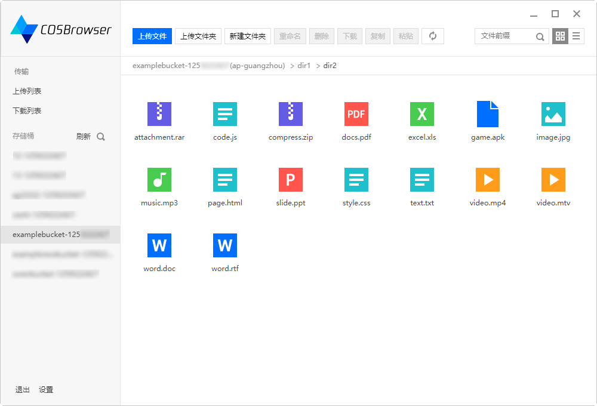

### 需求

　　我们使用电脑的过程中可能经常遇到一个问题：如何可靠地备份大文件？

　　进一步细化：

1. 大文件包括影音游、以前的工作资料等。未来再次使用的可能性较低，希望删除以释放硬盘空间，但又需要备份以备不时之需。
2. 只是个人使用或分享给认识的人，不进行公开分享。

　　传统上，这类问题一般用网盘解决（有些动手能力强的网友会自己在家搭建 NAS 系统，但维护成本较高，这里不讨论），网盘的问题是：

1. 服务不够可靠：一些小网盘公司 3 ~ 5 年就停止运营或倒闭，我怎么敢放心地把数据交给他们？
2. 会员收费高：某网盘号称免费，然而不开通超级会员则下载限速 100 ~ 200 KB/s ，超级会员每月 25 元

### 我们还有别的选择吗？

　　随着近几年云计算的兴起，出现了一类可以替代网盘的服务：云存储。

　　跟网盘相比，云存储的最大区别在于计费方式不同：**云存储完全是按使用量收费，用多少付多少**。

　　截止目前（2019 年 11 月），[腾讯云 COS 的收费方案](https://cloud.tencent.com/document/product/436/6239)如下：

* 存储：0.118 元 / GB / 月
* 上传：不收费
* 下载：某个文件第一次下载 0.65 元 / GB ，时间上接近的后续下载 0.5 元 / GB

　　也就是说，如果你的存储量小于 200（≈ 25 / 0.118）GB ，并且不经常下载，那用腾讯云 COS 更便宜。下载不限速，但每次下载需要付流量费。你也可以选择阿里云 OSS 、金山云等。

　　服务的可靠性方面，云服务的付费模式决定了它们比网盘的免费模式更具有可持续性。云提供商一般都有 [CDN 加速](https://www.zhihu.com/question/36514327)，在国内访问很快。唯一无法跟网盘相比的可能就是易用性，毕竟云存储一开始就不是 to C 而是 to B 的，而 [COSBrowser](https://cloud.tencent.com/document/product/436/11366) 等工具的出现使得云存储的用户体检已经跟网盘相差无几（COSBrowser 甚至还有手机客户端）。

### 云存储使用教程

　　对于不懂编程的普通用户，使用云存储还是需要一定动手能力的，但云存储对动手能力的要求远低于自己搭建 NAS 。下面我以腾讯云为例，详述如何使用云存储当网盘：

1. 进入[腾讯云](https://cloud.tencent.com)，首先注册一个账号，**注意需要用身份证号实名认证**
2. 在云产品中开通对象存储，新用户有 6 个月 50 GB 的免费额度
3. 创建一个存储桶

	- 什么是存储桶：存储桶相当于一个总的文件夹，作用是方便权限管理：你可以给不同用户分配不同存储桶的读写权限。如果你的账号不会给其他人用，那创建一个就够了
	- 所属地域：选择离自己较近的即可（不要选带“金融”字样的，一般人用不到）
	- 访问权限：私有读写
	- 存储桶创建好后，此时已经可以通过网页上传和下载文件了，但平时使用还是推荐客户端 COSBrowser ，因为更方便断点续传

4. 为使用 COSBrowser ，最好是单独创建一个子账号，便于控制权限

	- 顶部导航菜单 → 云产品 → 管理与审计 → 访问管理
	- 用户 → 用户列表 → 新建用户
	- 子用户 → 自定义创建。随便用一个用户名，比如 cosuser ，选中“启用编程访问”
	- 从策略列表中选择 QcloudCOSDataFullControl ，为新用户分配 COS 的全部权限
	- 成功创建用户后，复制 SecretId 和 SecretKey

5. 下载 [COSBrowser](https://cloud.tencent.com/document/product/436/11366) 并使用上一步得到的 SecretId 和 SecretKey 登录
6. 如何分享给其他人：通过网页控制台或 COSBrowser 都可以创建带有过期时间的临时链接，可供其他人下载（注：**其他人下载会在你的账号产生流量费用**）

### 其他备选方案

* [阿里云](https://cn.aliyun.com/product/oss) 价格跟腾讯云 COS 差不多，也提供了图形化客户端 [ossbrowser](https://help.aliyun.com/document_detail/61872.html)
* [七牛云](https://www.qiniu.com/products/kodo) 前 10 GB 存储免费，下载流量费也较低。但未提供类似 COSBrowser 的图形化客户端，只能通过网页端上传
* [又拍云](https://www.upyun.com/products/file-storage) 下载流量能抵扣存储费用。未提供图形化客户端，但似乎可以用 FTP 访问

　　利益相关：本人与上述提及的公司无任何利益相关，仅作为用户进行产品评测。
