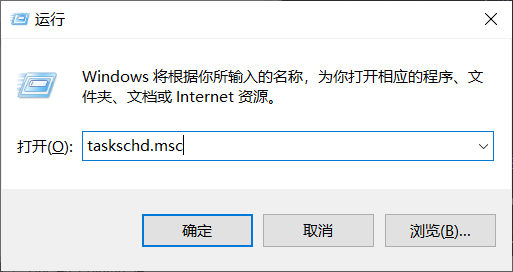
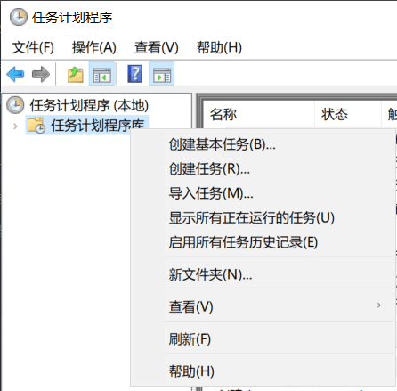
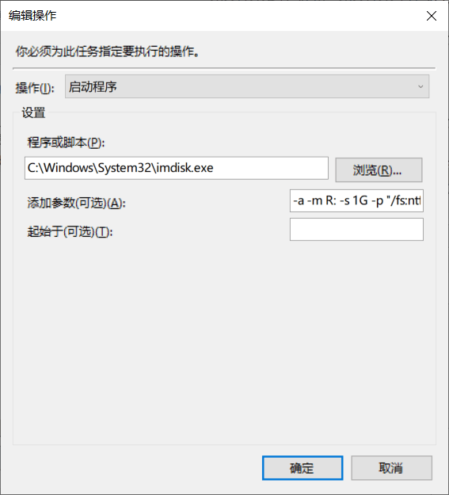

　　内存盘就是将一部分内存虚拟成磁盘，你可以用它来保存文件，重启之后保存的东西会丢失。

　　这样的东西有什么用？可以用来保存各种临时文件，比如从网上下载的、或者别人传过来的东西，很多时候我们只是临时看一下，不需要永久保存。

　　我平时用内存盘作为自己的临时工作区（working area）。就像人有工作记忆（working memory）一样，我相信如果你尝试了，你会发现这是一个很有用的东西。

## Windows 上的内存盘

　　Windows 操作系统并未自带这一基础工具。但有各种第三方实现，网上搜索“Ramdisk”你能找到很多。这里推荐 [LTRDATA 的 ImDisk Driver](https://web.archive.org/web/20221220103841/https://www.ltr-data.se/opencode.html/)。

* [官方 FAQ](https://web.archive.org/web/20220803020241/http://reboot.pro/index.php?showtopic=15593)
* [w77 制作的额外工具包](https://sourceforge.net/projects/imdisk-toolkit/)
* 以上链接均需要科学上网，如果你访问有困难，可以使用我的[镜像下载链接](https://bin.henix.info/imdisk/imdiskinst.exe)

　　安装好后“控制面板”中会多出一个“ImDisk Virtual Disk Driver”。

　　它默认不会帮你创建内存盘，推荐使用“计划任务”在每次开机时创建。

1\. 按 Win + R 调出“运行”对话框，输入“taskschd.msc”回车，调出“计划任务”。

2\. 选择“任务计划程序库”，右键，“创建任务”

3\. 设置的关键点：

* “常规”选项卡，“运行任务时，请使用下列用户账户”选择“SYSTEM”
* “触发器”选项卡，添加“系统启动时”触发
* “操作”选项卡，添加“启动程序”

	- “程序或脚本”为 `C:\Windows\System32\imdisk.exe`
	- “添加参数”为 `-a -m R: -s 1G -p "/fs:ntfs /q /y"`
	- 这些参数的意义：

		+ -m R: 表示赋予卷标 R:
		+ -s 1G 表示内存盘大小 1GB
		+ -p 后面是传给 format 命令的参数，这里用 ntfs 文件系统格式化

* “条件”选项卡，取消“只有在计算机使用交流电源时才启动此任务”
* “设置”选项卡，“如果此任务已经运行，以下规则适用”选择“请勿启动新实例”

4\. 创建好这个任务后，右键，“运行”，即可在不重启的情况下先创建出内存盘。此后每次启动都会自动创建内存盘

　　最后的效果：你会在资源管理器中看到你指定的卷标（如 R:）的一个盘。

## Linux 上的内存盘

　　使用 tmpfs 文件系统挂载任一目录即可，参考 <https://wiki.archlinux.org/title/tmpfs>
